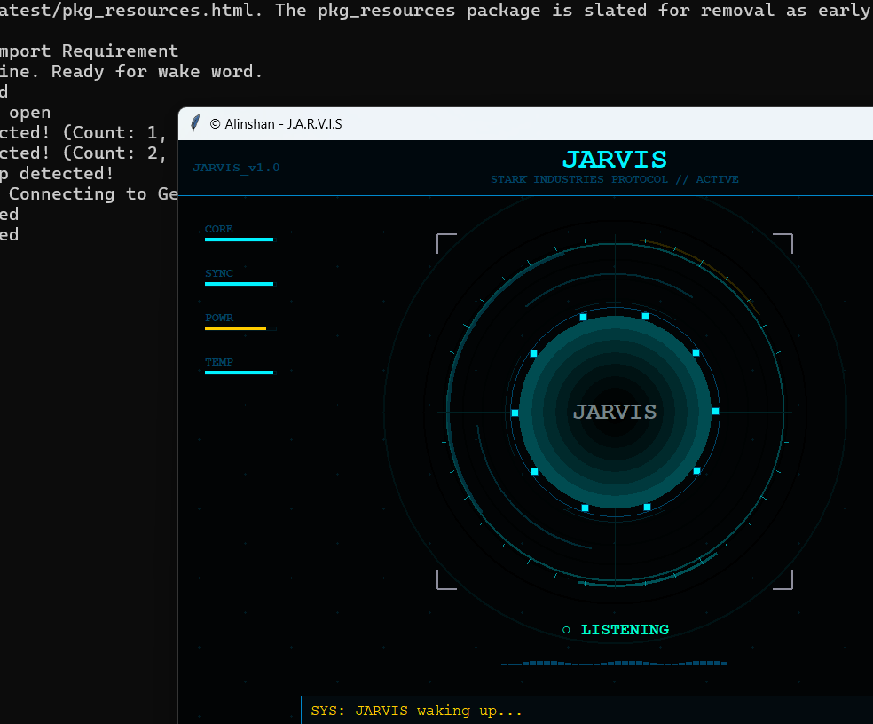

# J.A.R.V.I.S - Mark-I 🚀

Welcome to J.A.R.V.I.S (Just A Rather Very Intelligent System). This is a professional-grade AI assistant built to operate as a background-first, hands-free companion for Windows.



## 🌟 Key Features
- **Voice Activation**: Responds to "Hey Jarvis" even when hidden.
- **Gesture Control**: Double-clap detection for instant wake-up.
- **Silent operation**: Runs in the background via VBScript without messy terminal windows.
- **Computer Vision**: Can "see" and analyze your screen to help with tasks.
- **Global Automation**: Controls your browser, desktop apps, and system settings.
- **Dynamic UI**: Responsive Stark Industries inspired interface.

## 🛠️ Installation

### 1. Prerequisites
- **Python 3.10 or higher** installed.
- **Windows OS** (required for background automation features).
- A working **Microphone**.

### 2. Setup
Clone the repository and install dependencies:
```bash
git clone https://github.com/Alinshan/JARVIS-
cd JARVIS-
pip install -r requirements.txt
playwright install chromium
```

### 3. API Configuration
Create a `.env` file in the root directory and add your Google Gemini API Key:
```env
GEMINI_API_KEY=your_key_here
```

### 4. Enable Startup (Optional)
To have JARVIS start automatically when you turn on your PC:
```bash
python install_startup.py
```

## 🚀 Usage

### Hidden Background Mode (Recommended)
Double-click `launcher.vbs`. JARVIS will start silently in your task manager. Just say **"Hey Jarvis"** or **Double-Clap** to bring him to the screen.

### Visual Mode (Developer/Debug)
Run directly via Python:
```bash
python main.py
```

## ⌨️ Controls
- **[F4]**: Quick Mute/Unmute microphone.
- **[Shutdown]**: Completely kills the background process and releases hardware.

## 📜 License
MIT License - Created by Alinshan
